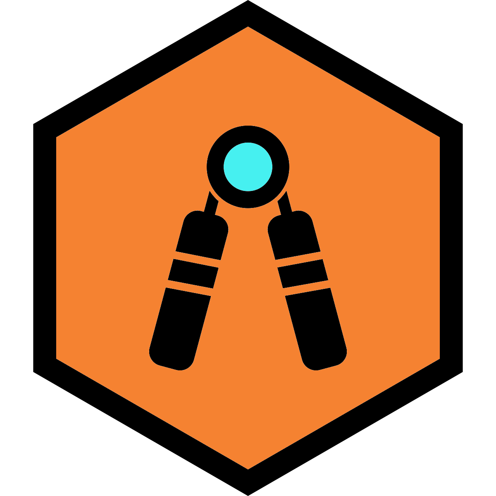
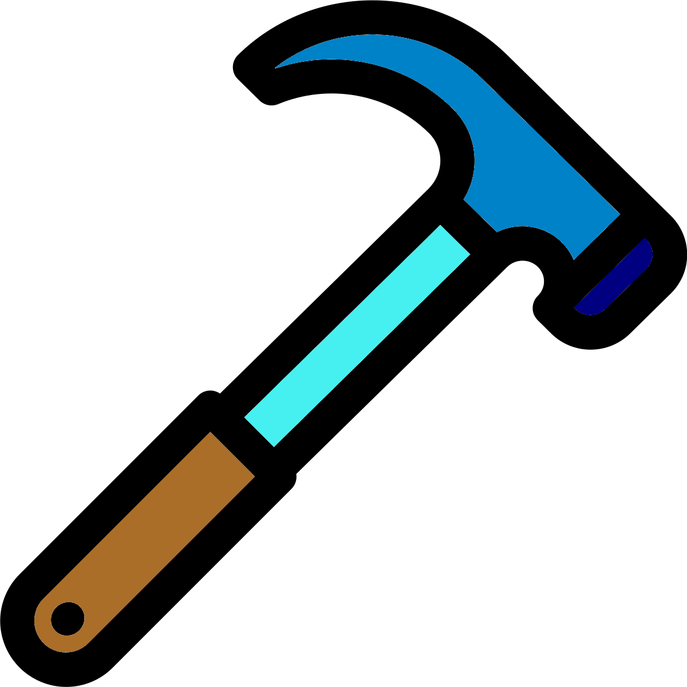
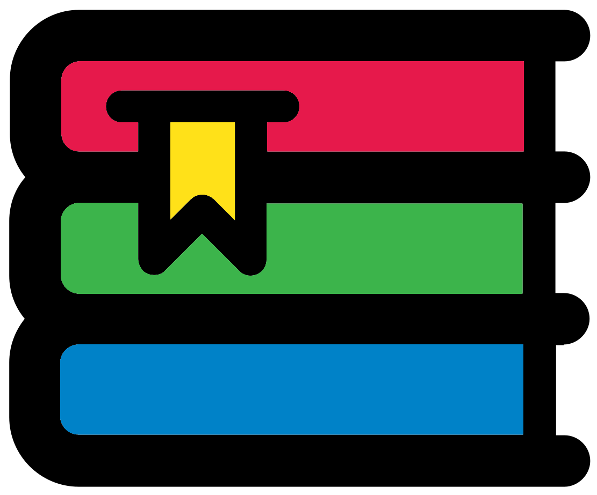

# (PART\*) Self-Evaluation and Reflection {-}

# Reflection or: Considering my strengths and weaknesses

{style="width:200px"}

This patch starts off this Portfolio with a common theme of reflection. It gave me a chance to explore my strengths and areas of improvements in many different areas.

## Strengths

{style="width:200px"}

At this point my known strengths include:

- Long experience of creating, organising, and running bioinformatics workshops for postgrads (A1 & A2).
- I create online teaching environments with various technologies (Zoom, OBS, Slack, R Bookdown, and webVNC) (A4 & K4).
- I have attended teaching courses and am an AFHEA via the FLTHE course (A5).
- I am a knowledgeable and experienced practitioner of my topic (Bioinformatics) (K1).
- I gain student feedback verbally and through google forms for each workshop (K5).

## Improvements

{style="width:200px"}

Just as important my areas of improvement include:

- Increasing my pedagogical knowledge and qualifications. Ideally, I would like to continue and complete the MA of academic practice.
- I teach primarily through workshops and would like more experience and knowledge of different teaching approaches and aspects of academic teaching.
- More patience for learners asking questions covered in materials.
- Motivating unmotivated learners.
- Leadership, conflict management, & delegation skills.
- Gaps in my knowledge & skills within bioinformatics.
- Incorporating MCQs into my materials (A3).
- Providing continuing support to workshop attendees (A4).

## Literature

{style="width:200px; background: white; border-radius:15px; border: 5px white solid"}

Prior to this PGCAP I had read a good amount of literature for my FLTHE (A5). During the PGCAP I plan to read Phil Race's "The Lecturer's Toolkit A Practical Guide to Assessment, Learning and Teaching" which I started in my FLTHE.

## Conclusion & plan

{style="width:200px"}

My feedback was very positive mainly aiming to point me to various other frameworks and drivers.

I am a confident teacher. I run a lot of workshops with a great team and we receive very positive feedback. We run online workshops with very appropriate technologies. We aim to have very good materials the learners follow so they can work at their own pace. This in addition to us trying to be very approachable aims to create a very inclusive and collaborative environment (V2). Or, as I like to call it a "smart casual" environment.

With all this my plans of improvement are:

- Include formative assessment in the online materials via MCQs and drop down help boxes.
- Learn new bioinformatics skills/knowledge that learners want/need.
- Improve my conflict management skills and patience.
- Improve my pedagogical knowledge.
- Provide better formative feedback to learners.
- Learn how to motivate learners better.