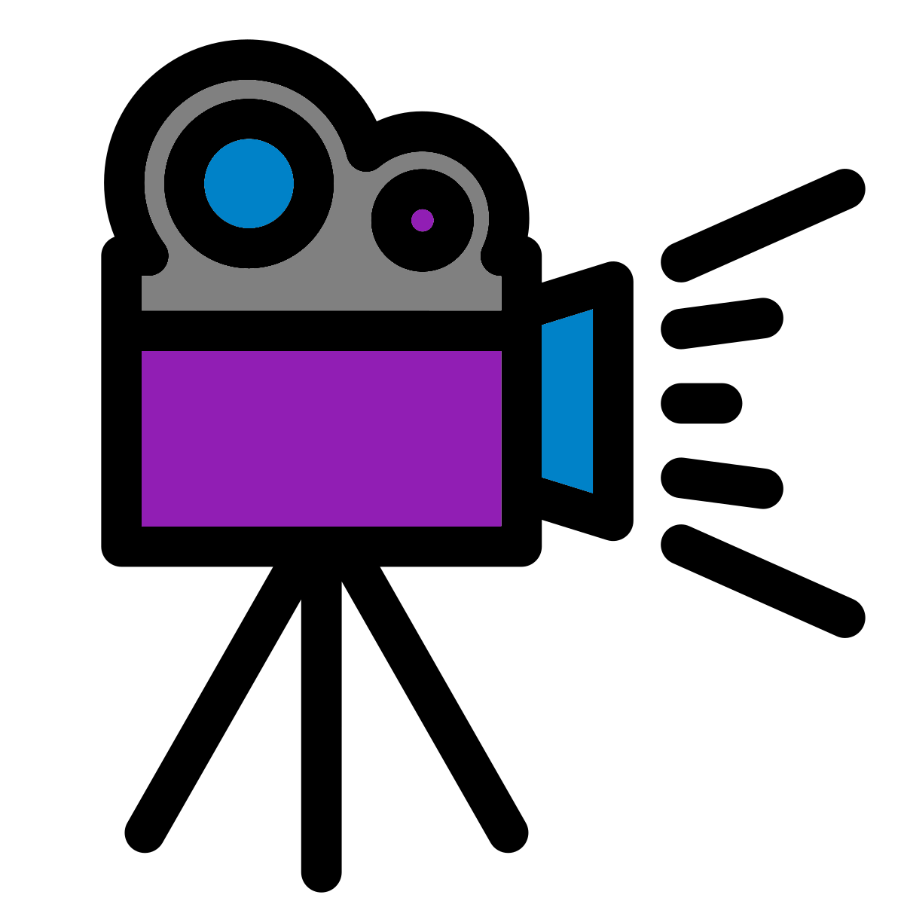

# (PART\*) Digital Storytelling {-}

# My Smart Casual Approach or: Taking the good and avoiding poor practices

{style="width:200px; background: white; border-radius:15px; border: 5px white solid"}

The topic I covered with my Digital Storytelling was my "Smart Casual" teaching approach. I gained this by watching my previous teachers and taking the good practices and leaving the poor practices. As Phil race says, avoiding poor practices can lead to effective learning (V3)(P Race, 2019).

## Good & poor practices

{style="width:200px"}

Two types of teachers I have experienced are:

- Mr Casual: Engaging but informative.
- Professor Smart: Informative but dull.

Therefore my "Smart Casual" approach aims to be:

- Engaging
  - Storytelling, Case studies, and interesting context (K3 & V3)(Hoffer, 2020)
  - Interactive digital materials with literature, practice, exercises, MCQs, & videos (K4)(Bikowski & Casal, 2018)
- Informative
  - Working memory is limited, therefore teach what is relevant and don’t explain every single minutiae (K3)(Paas & van Merriënboer, 2020)
  - Extra materials & Further online resources can improve higher order thinking skills (K4)(Purnomo et al, 2020)
- Inclusivity
  - Work at own pace (V1)(Clark et al, 2019)
  - Humour & praise encourages participation & positive environment (A4 & V2)(Lovorn & Holaway, 2015)

## Conclusion

{style="width:200px; background: white; border-radius:15px; border: 5px white solid"}

This patch gave me a chance to practice recording a talk and watching it back. I have a lot of practice recording my presentations but like most people I don't like hearing my recorded voice. Therefore I don't watch my recordings as often as I should. This is something I intend to change.

My "Smart casual" teaching approach is a good approach for me that is backed by literature. Of course it is not the best approach for everyone as everyone is different but it always good to avoid poor practices. 

As my feedback advises I will continue to try to develop by reading literature, reflecting, and exploring University policies and specifically the Liverpool Curriculum Framework in patch 4.